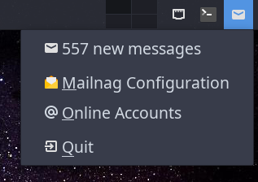

# Mailnag Tray

A tray icon applet for mail monitoring using mailnag and written on QT to
support any desktop environment that supports a standard system tray.

* OS: Linux
* License: GPLv2

## Requirements

* [Mailnag](https://github.com/pulb/mailnag) - mail notifications
* [QT6](https://www.qt.io/) - graphical interface and dbus ipc
* [Libnotify](https://gitlab.gnome.org/GNOME/libnotify) - message notifications
* [Meson](https://mesonbuild.com/) - build the application

## Compilation

To build the application execute the following commands:

```sh
meson setup build --prefix /usr
meson compile -C build
```

## Installation

After a successfull build you can install the utility globally by executing:

```sh
sudo meson install -C build
```

### ArchLinux

A PKGBUILD is available on the Arch User Repository:

```sh
yay -S mailnagtray
```

## Screenshots


